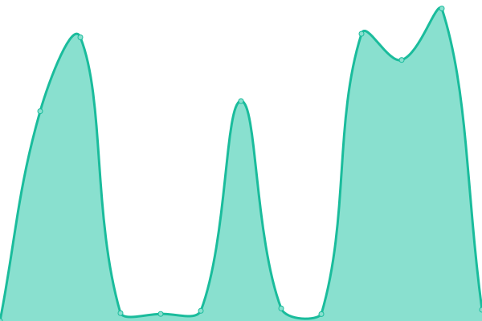

# [📈 Live Status](https://20enzo.github.io/TVAberta): <!--live status--> **🟧 Partial outage**

This repository contains the open-source uptime monitor and status page for (www.fastsolutioninfo.com), powered by [Upptime](https://github.com/upptime/upptime).

We use [Issues](https://github.com/20enzo/TVAberta/issues) as incident reports, [Actions](https://github.com/20enzo/TVAberta/actions) as uptime monitors, and [Pages](https://20enzo.github.io/TVAberta) for the status page.

<!--start: status pages-->
<!-- This summary is generated by Upptime (https://github.com/upptime/upptime) -->
<!-- Do not edit this manually, your changes will be overwritten -->
<!-- prettier-ignore -->
| URL | Status | History | Response Time | Uptime |
| --- | ------ | ------- | ------------- | ------ |
|  [🎥 Servidor de Transmissão (Vídeo)](https://br5093.streamingdevideo.com.br/tvaberto/tvaberto/chunklist_w694789056.m3u8) | 🟩 Up | [servidor-de-transmissao-video.yml](https://github.com/20enzo/TVAberta/commits/HEAD/history/servidor-de-transmissao-video.yml) | 

 939ms
     
 | 

<a href="https://status.fastsolutioninfo.com/history/servidor-de-transmissao-video">100.00%</a>
    

|  [🤖 Chatbot WhatsApp (Cloud Run)](https://chatbot-whatsapp-zny5gc7sqq-uc.a.run.app/health) | 🟥 Down | [chatbot-whats-app-cloud-run.yml](https://github.com/20enzo/TVAberta/commits/HEAD/history/chatbot-whats-app-cloud-run.yml) | 

 1447ms
     
 | 

<a href="https://status.fastsolutioninfo.com/history/chatbot-whats-app-cloud-run">93.33%</a>
    

|  🧠 API do Google Gemini | 🟩 Up | [api-do-google-gemini.yml](https://github.com/20enzo/TVAberta/commits/HEAD/history/api-do-google-gemini.yml) | 

 128ms
     
 | 

<a href="https://status.fastsolutioninfo.com/history/api-do-google-gemini">100.00%</a>
    

|  📊 Google Sheets (Planilhas) | 🟩 Up | [google-sheets-planilhas.yml](https://github.com/20enzo/TVAberta/commits/HEAD/history/google-sheets-planilhas.yml) | 

 135ms
     
 | 

<a href="https://status.fastsolutioninfo.com/history/google-sheets-planilhas">100.00%</a>
    

<!--end: status pages-->

[**Visit our status website →**](https://20enzo.github.io/TVAberta)

## 📄 License

- Powered by: [Upptime](https://github.com/upptime/upptime)
- Code: [MIT](./LICENSE) © [Anand Chowdhary](https://anandchowdhary.com), supported by [Pabio](https://pabio.com)
- Data in the `./history` directory: [Open Database License](https://opendatacommons.org/licenses/odbl/1-0/)
